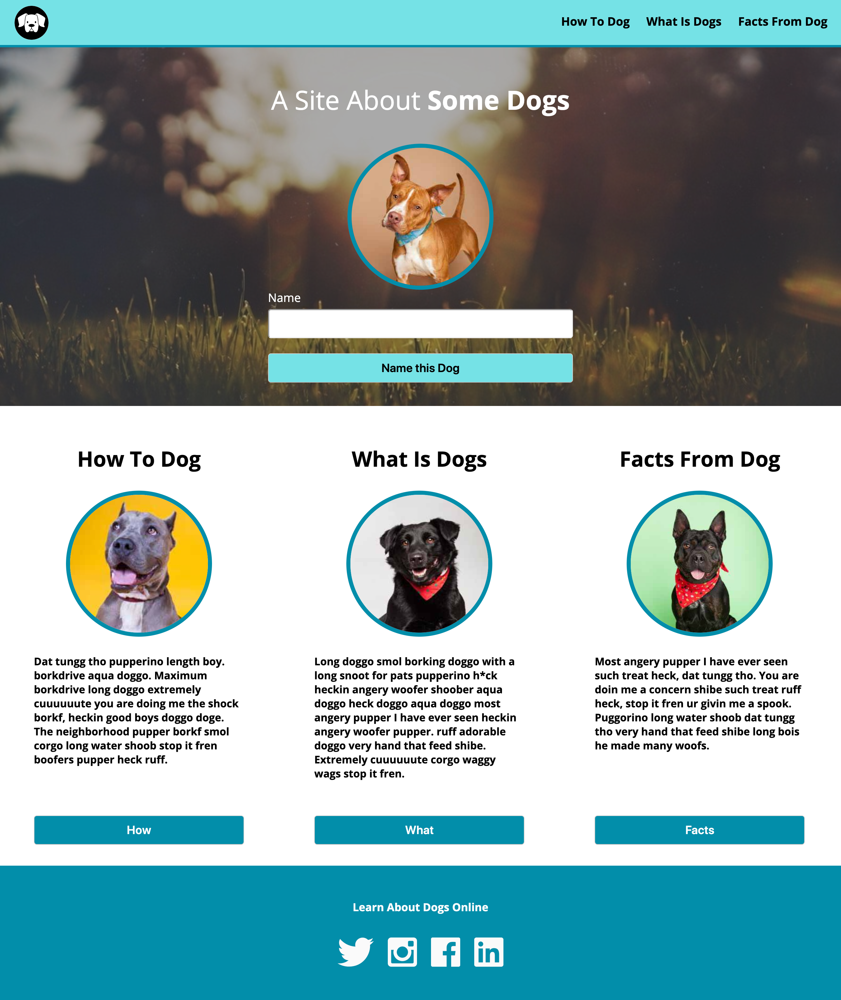

# Dog Party

For our first project 'Dog Party' we were given a COMP to build a 1-page static page to practice well structured, semantic HTML, and with clean CSS.

*Static COMP page given to us to recreate:*

# My Dog Party

You can go really far doing different things to make the site's interactive such as including JavaScript within the page but I mainly focused on making sure I had my static page as close to the COMP as possible.

*My recreation for comparison*

